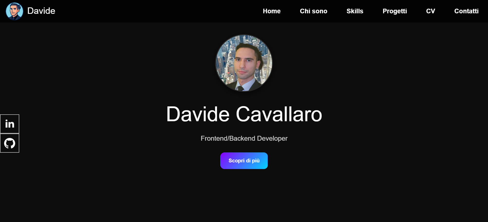

# Davide Cavallaro - Portfolio Personale

## Descrizione
Questo è il mio sito personale/portfolio realizzato con **HTML, CSS (SCSS) e Bootstrap**.  
Mostra chi sono, le mie competenze, i miei progetti e un modo per contattarmi.

---

## 📌 Contenuti
- **Home**: landing page con foto, descrizione e link ai social.  
- **Chi sono**: breve bio personale e accademica.  
- **Skills**: competenze in HTML, CSS, Java, C, JS e Bootstrap.  
- **Progetti**: mostra dei progetti realizzati (link al GitHub).  
- **CV**: curriculum in formato HTML.  
- **Contatti**: form di contatto collegato a EmailJS.  

---

## 🛠 Tecnologie
- HTML5
- CSS3 / SCSS
- Bootstrap 5
- EmailJS (solo per il form)
- GitHub Pages (hosting)

---

## 🔗 Link
- GitHub: [https://github.com/maidire3/ProgettoHtmlCSS](https://github.com/maidire3/ProgettoHtmlCSS)  
- Linkedin: [https://www.linkedin.com/in/davide-cavallaro-89aa811a1/](https://www.linkedin.com/in/davide-cavallaro-89aa811a1/)  

---

## ⚡ Funzionalità aggiuntive
- Design moderno e responsive  
- Navbar sticky e adattativa  
- Animazioni leggere  
- Form contatti funzionale  
- Open Graph meta tags implementati  

---

## 🧹 Note sul codice
- SCSS modulare per componenti (navbar, form, CV)  
- Variabili per colori e gradienti  
- Layout combinato **Flex + Grid**  
- Codice pulito, commenti minimi per leggibilità  

---

## 📸 Anteprima

---

## 📝 Licenza
Questo progetto è solo a scopo dimostrativo / portfolio personale.
